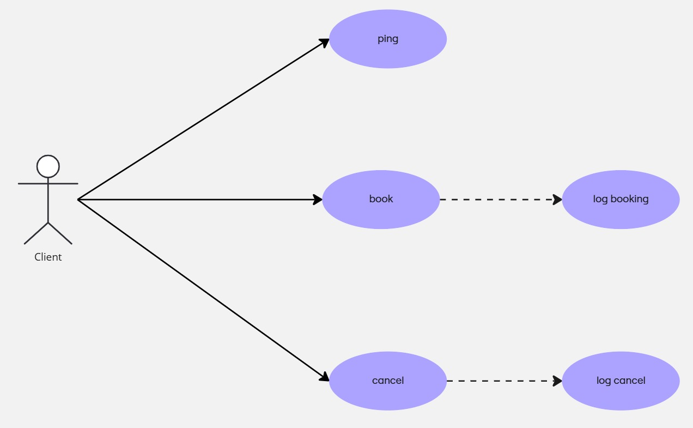
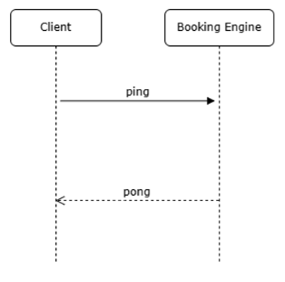
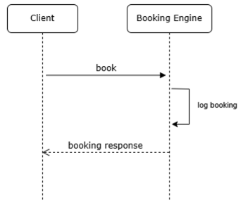
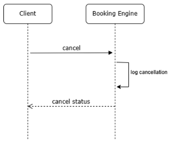
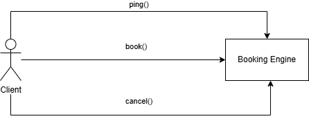

# Docker Image By Zelda Garrocho

This is a booking engine for reserving rooms in a hostel. 
Reservations can be done for several pax (clients) and for several days

Service only provides beds in shared rooms, that have a fixed price of 100 EUR per pax and per night.

Engine allows canceling existing bookings.

## Assumptions

This is a very simple project that:
- booking and cancellation services are partially implemented: reservations are not stored in any database, available inventory is not updated, ...
- does not have error control.


## Ping
Ping service is a GET service available at /api/ping, that does not expect any parameter, and it returns a simple string "pong". It can be used to check that app is working properly.

## Book Service
Booking service is a POST service available at path /api/book, and it requires a valid booking request in json format:
```
    {
        "hotelCode": "AMTS00000",
        "roomCode": "BUNK",
        "boardCode": "BB",
        "checkIn": "2025-06-23",
        "checkOut": "2025-06-30",
        "guests": [
            "Pax1",
            "Pax2"
        ]
    }
```

Response contains three fields: status, booking reference and totalPrice:
```
{
    "status": "OK",
    "bookingRef": "ref-7VY6LSUE",
    "totalPrice": 1400.0
}
```

### Log Booking
Each processed booking is tracked in a logging system.

## Cancel Service
Cancel service is a POST service available at path /api/cancel, and it requires a valid booking reference to be cancelled:
```
{
    "bookingRef": "ref-7VY6LSUE"
}
```

Response contains status:
```
{
    "status": "CANCELLED"
}
```
### Log Cancel
Each processed cancellation is tracked in a logging system.

# Build and Test

### Requirements

- JDK 17


### Build a Jar package

```console
$ mvn package
```

### Test

No test

# UML

## Use Cases



## Sequence Diagrams

### Ping


### Book


### Cancel


## Communication Diagram



